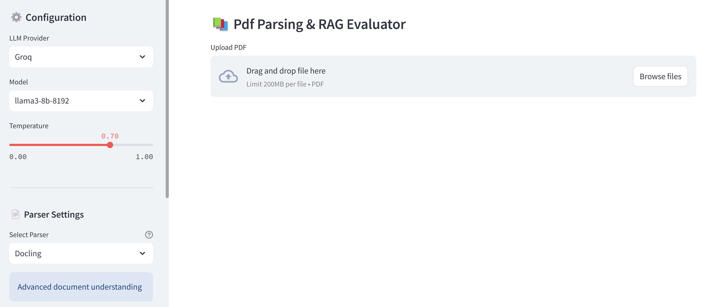

<div align="center">
<a href="https://www.instagram.com/genieincodebottle/"></a>
</div>
<br>

<div align="center">
    <a target="_blank" href="https://www.youtube.com/@genieincodebottle"></a>&nbsp;
    <a target="_blank" href="https://www.linkedin.com/in/rajesh-srivastava"></a>&nbsp;
    <a target="_blank" href="https://www.instagram.com/genieincodebottle/"></a>&nbsp;
    <a target="_blank" href="https://medium.com/@raj-srivastava"></a>&nbsp;
    <a target="_blank" href="https://x.com/zero2nn"></a>
</div>

# ParseMyPDF

> **Learn how to build this project step-by-step on [AI-ML Companion](https://aimlcompanion.ai/)**. Interactive ML learning platform with guided walkthroughs, architecture decisions, and hands-on challenges.


**Twenty-three PDF parsers and nine vision-OCR paths, pointed at the same five
deliberately awkward PDFs. Nine of them need no API key at all, so you can see
the comparison working before signing up for anything.**

---

## 1. Why this exists

"Extract the text from a PDF" sounds solved until the PDF has a merged cell, a
rotated header, a scanned table, or two columns. Then every library gives a
different wrong answer, and the only way to choose is to run several on your
own document and read the output.

Here is that comparison, already wired up. And here is the thing worth
internalising, measured on the bundled samples:

| Sample | Pages | Text layer | What that means |
|---|---|---|---|
| `sample-1.pdf` | 1 | 396 chars | ordinary tables, any parser handles it |
| `sample-2.pdf` | 1 | **2 chars** | effectively a scan - plain parsers return nothing |
| `sample-3.pdf` | 2 | **42 chars** | effectively a scan, with merged cells |
| `sample-4.pdf` | 6 | 9,019 chars | mixed text, tables and images |
| `sample-5.pdf` | 3 | 4,564 chars | multi-column; reading order is the problem |

`sample-2` and `sample-3` have almost no text layer. **A parser that returns
nothing on them is not broken - it is telling you the document needs OCR or a
vision model.** That distinction is most of the value here.

A second measured example: on `sample-5`, pypdf returns 32 bytes while PyMuPDF
reads 4,564 characters from the same file. Same PDF, same machine, different
library.

## 2. Quick start

### Prerequisites

Python 3.10 or higher, and git.

### Install with uv

[uv](https://docs.astral.sh/uv/) is a fast drop-in replacement for pip and
venv. Install it once:

```bash
pip install uv
```

Then clone and create the environment:

```bash
git clone https://github.com/genieincodebottle/parsemypdf.git
cd parsemypdf

uv venv
```

Activate it:

```bash
# Windows PowerShell
.venv\Scripts\activate

# Windows cmd
.venv\Scripts\activate.bat

# Linux / macOS
source .venv/bin/activate
```

Install the dependencies:

```bash
uv pip install -r requirements.txt
```

This is a large install - roughly 200 packages including torch, docling and
surya - because the point of the repo is breadth. If you only want one or two
parsers, see [section 6](#6-installing-only-what-you-need).

### Run one, with no API key

```bash
python parser/pymupdf/lc_pymupdf.py
```

That is the whole first step. No `.env`, no signup, no model download.

### Try a harder document

Every parser takes `--file`. You do **not** need to edit any source code:

```bash
python parser/pymupdf/lc_pymupdf.py --file input/sample-5.pdf
python parser/pymupdf/lc_pymupdf.py --file /path/to/your/own.pdf
python parser/pymupdf/lc_pymupdf.py --list      # list the bundled samples
```

Results are written to `output/<parser-name>.txt`, so runs from different
parsers sit side by side instead of overwriting each other.

### The UI

```bash
streamlit run pdf_parser_app.py     # all PDF parsers, plus RAG Q&A
streamlit run vlm_ocr_app.py        # vision-language OCR paths
```



## 3. Keys - what you actually need

**Nine parsers need nothing.** Start there. Add a key only when you want a
vision model for a scanned document.

| Key | Unlocks | Cost | Where |
|---|---|---|---|
| none | pypdf, PyMuPDF, pdfplumber, pdfminer, pypdfium, PyPDFDirectory, Camelot, MarkItDown, Docling | free | - |
| `GOOGLE_API_KEY` | Gemini parser, and the OpenAI parser's free fallback | free tier | [aistudio.google.com/apikey](https://aistudio.google.com/apikey) |
| `ANTHROPIC_API_KEY` | Claude parsers | paid | [console.anthropic.com](https://console.anthropic.com/settings/keys) |
| `OPENAI_API_KEY` | OpenAI parser, Zerox | paid | [platform.openai.com](https://platform.openai.com/api-keys) |
| `MISTRAL_API_KEY` <br>or `MISTRAL_AI_API_KEY` | Mistral OCR | paid | [console.mistral.ai](https://console.mistral.ai/api-keys) |
| `LLAMA_CLOUD_API_KEY` <br>or `LLAMA_PARSE_API_KEY` | LlamaParse | 1,000 pages/day free | [cloud.llamaindex.ai](https://cloud.llamaindex.ai/api-key) |
| `UNSTRUCTURED_API_KEY` | Unstructured.io - must be a **Serverless Partition** key, not a Platform key | free tier | [unstructured.io/api-key-free](https://unstructured.io/api-key-free) |
| `AZURE_DI_ENDPOINT` + `AZURE_DI_KEY` | Azure Document Intelligence | 500 pages/month free | [Azure](https://learn.microsoft.com/azure/ai-services/document-intelligence/) |
| AWS credentials | Amazon Textract | paid | your AWS account |

```bash
cp .env.example .env      # then fill in only what you need
```

**The OpenAI parser runs without an OpenAI key.** It renders each page to an
image and needs a *vision* model, so when `OPENAI_API_KEY` is missing it uses
Gemini's OpenAI-compatible endpoint with your free `GEMINI_API_KEY` instead.
Nothing else in the script changes.

### Local models, no key

```bash
# Install Ollama from https://ollama.com/download
ollama pull llama3.1
ollama pull x/llama3.2-vision:11b
```

GOT-OCR2 and Surya download their own weights on first run (about 1.5 GB and
2 GB). No account needed, but the first run is slow.

## 4. The parsers

### No key required

| Parser | Best at | Code |
|---|---|---|
| PyMuPDF | speed; the sensible default to try first | [parser/pymupdf](/parser/pymupdf/) |
| pdfplumber | tables into DataFrames, visual debugging | [parser/pdfplumber](/parser/pdfplumber/) |
| pypdf | split, merge, crop, basic text | [parser/pypdf](/parser/pypdf/) |
| PDFMiner | text plus layout detail | [parser/pdfminer](/parser/pdfminer/) |
| pdfium | the renderer behind Chromium | [parser/pypdfium](/parser/pypdfium/) |
| PyPDFDirectory | batch extraction over a folder | [parser/pypdfdirectory](/parser/pypdfdirectory/) |
| Camelot | tables with grid lines (lattice) or whitespace (stream) | [parser/camelot](/parser/camelot/) |
| MarkItDown | many formats to Markdown | [parser/markitdown](/parser/markitdown/) |
| Docling | complex PDFs with mixed content | [parser/docling](/parser/docling/) |

### Local models, no key, but a download

| Parser | Notes | Code |
|---|---|---|
| GOT-OCR2 | ~1.5 GB; strong on dense scanned pages | [parser/got-ocr2](/parser/got-ocr2/) |
| Surya OCR | ~2 GB; 90+ languages with layout analysis | [parser/surya-ocr](/parser/surya-ocr/) |
| Llama Vision | via Ollama; multimodal, fully local | [parser/llama-vision](/parser/llama-vision/) |

### Cloud APIs

| Provider | Models | Code |
|---|---|---|
| Gemini | `gemini-pro-latest`, `gemini-flash-latest`, `gemini-flash-lite-latest` | [parser/gemini](/parser/gemini/) |
| Anthropic | `claude-opus-5`, `claude-sonnet-5`, `claude-sonnet-4-6`, `claude-haiku-4-5` | [parser/claude](/parser/claude/) |
| OpenAI | `gpt-5.6-sol`, `gpt-4.1` - or free through Gemini | [parser/openai](/parser/openai/) |
| Mistral OCR | `mistral-ocr-latest` | [parser/mistral_ocr](/parser/mistral_ocr/) |
| LlamaParse | RAG-oriented parsing | [parser/llama-parse](/parser/llama-parse/) |
| Unstructured.io | partitioning mixed documents | [parser/unstructured-io](/parser/unstructured-io/) |
| Amazon Textract | forms, signatures, scans | [parser/amazon-textract](/parser/amazon-textract/) |
| Azure Doc Intelligence | key-value pairs, handwriting | [parser/azure-doc-intelligence](/parser/azure-doc-intelligence/) |
| Zerox | vision OCR via litellm | [parser/zerox](/parser/zerox/) |

Nine more vision-OCR paths live in [vlm_ocr/](/vlm_ocr/).

## 5. Choosing one

A decision order, not a ranking:

1. **Does the PDF have a text layer?** Try `PyMuPDF` first - it is instant and
   free. If it returns almost nothing, the document is a scan and no plain
   parser will help.
2. **Tables with visible grid lines?** Camelot in lattice mode.
3. **Scanned, rotated, or handwritten?** You need a vision model. Gemini's free
   tier is the cheapest way to find out whether one can read it at all.
4. **Multi-column text?** Reading order defeats most naive extractors; Docling
   and the vision models handle it best.
5. **Feeding a RAG pipeline?** LlamaParse and Docling emit chunk-friendly
   structure rather than a wall of text.

## 6. Installing only what you need

The full `requirements.txt` is deliberately broad. For a single parser:

```bash
uv pip install pymupdf langchain-community      # PyMuPDF
uv pip install pdfplumber langchain-community   # pdfplumber
uv pip install camelot-py ghostscript           # Camelot
uv pip install docling                          # Docling
uv pip install google-genai                     # Gemini
```

## 7. If something goes wrong

Every row below is an error that actually occurred while testing this repo from
a clean install.

| symptom | cause | fix |
|---|---|---|
| `ModuleNotFoundError: No module named 'langchain.chains'` | LangChain 1.x moved the legacy chains | fixed here; re-pull. Elsewhere use `langchain_classic.chains` |
| `UnicodeEncodeError: 'charmap' codec can't encode` | writing extracted text without `encoding="utf-8"` on Windows | fixed here; all parsers now write UTF-8 |
| `--file` seems ignored | an older copy had a second `file_path =` that silently overrode it | fixed here; re-pull |
| `404 ... no longer available to new users` | a retired model ID | use the rolling aliases this repo now ships |
| `429 insufficient_quota` on OpenAI | valid key, no credit | set `GEMINI_API_KEY`; the OpenAI parser uses it instead |
| `messages[0].content must be a string` | a text-only model was sent an image | that parser needs a vision model - Gemini or GPT-4o class |
| Camelot: `Ghostscript is not installed` | native dependency | install Ghostscript, then reopen the terminal |
| `ValueError: ... key not set` and similar | that parser is cloud-only | use a no-key parser, or add the key |
| Key is in `.env` but the script says it is missing | the variable name differs | Mistral accepts `MISTRAL_API_KEY` or `MISTRAL_AI_API_KEY`; LlamaParse accepts `LLAMA_CLOUD_API_KEY` or `LLAMA_PARSE_API_KEY` |
| `401 API key is invalid` on Unstructured | you have a Platform key; the loader needs a Serverless Partition key | get one at [unstructured.io/api-key-free](https://unstructured.io/api-key-free) |
| Ollama parsers: connection refused | daemon not running | `ollama serve` in another terminal |
| Textract: `NoCredentialsError` | no AWS credentials | `aws configure` |
| First run of GOT-OCR2 or Surya takes a long time | downloading 1.5-2 GB of weights | expected once; cached afterwards |
| Llama Vision seems to hang | a vision model on CPU via Ollama | it is working; allow 5+ minutes, or use a GPU |
| A parser returns empty text | the PDF has no text layer | that is the finding - use a vision model |

## 8. Layout

```
pdf_parser_app.py      Streamlit UI for the PDF parsers, with RAG Q&A
vlm_ocr_app.py         Streamlit UI for vision-language OCR
parser/                one folder per parser, each runnable on its own
vlm_ocr/               one folder per vision-OCR path
utils/cli.py           the shared --file / --list handling
input/                 the five sample PDFs
output/                where parsers write their results
pdf-parsing-guide.pdf  the visual guide to the whole subject
```

## 9. Honest limitations

- **Nothing here is scored.** There is no ground truth for the samples and no
  accuracy metric. The output is for you to read and judge, which is the honest
  position: "correct" depends on your document.
- **Cost is not shown.** Vision parsers charge per page. Test on one page.
- **Vision output is non-deterministic.** The same PDF twice can give different
  table formatting.
- **Cloud parsers send your document to a third party.** If it is confidential,
  use the no-key parsers - they make no network call.
- **Verified end to end from a clean install:** the nine no-key parsers,
  Docling, GOT-OCR2, Llama Vision, the Gemini parser, both Claude parsers, the
  OpenAI parser through Gemini's endpoint, Mistral OCR and LlamaParse.
  **Not verified:** Unstructured.io, Amazon Textract, Azure Document
  Intelligence and Zerox - no usable key was available. Their model IDs and
  imports are current, but they were not run.
- **Two parsers are slow rather than broken.** Llama Vision runs a vision
  model locally through Ollama and took over 5 minutes per document on CPU
  here. Surya OCR downloads about 2 GB on first run, and on this machine then
  asked for a newer CUDA driver. Neither is a code fault; both need patience
  or a GPU.
- **Some parsers need native dependencies** (Ghostscript for Camelot, Tesseract
  for parts of Unstructured) that pip cannot install for you.

## 10. Further reading

- [PDF parsing guide (PDF)](./pdf-parsing-guide.pdf) - the visual companion
- [GenAI Roadmap](https://github.com/genieincodebottle/generative-ai/blob/main/GenAI_Roadmap.md)
